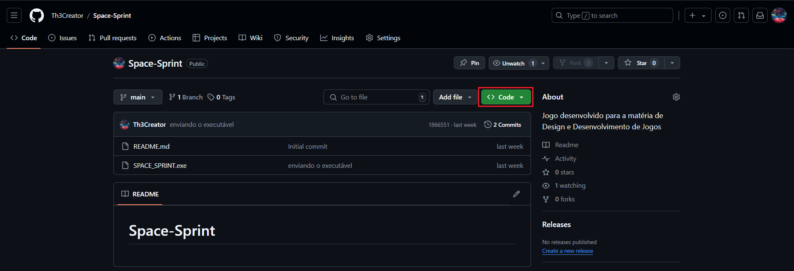
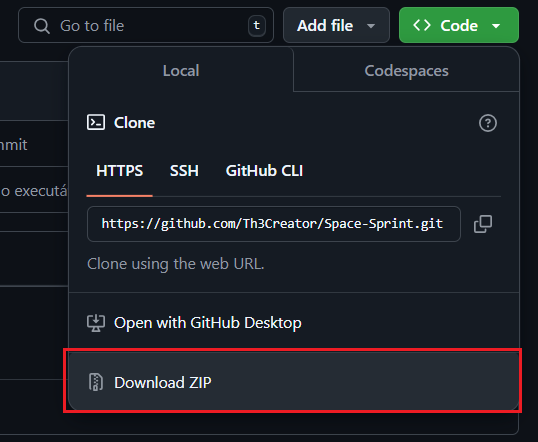
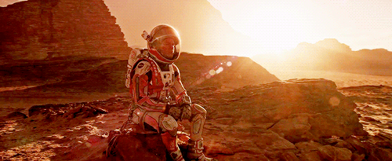
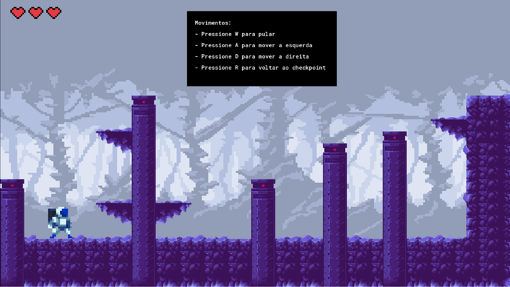

<h1>Como baixar e jogar ❓</h1>
Para baixar é muito simples, vá até o canto direito superior em "code" conforme o print abaixo, depois clique na opção zip:

<h2>História 📖</h2>
Space Sprint conta a história de um astronauta que em uma viagem exploratória em que sua nave sofre colisões e acaba se encontrando um novo sistema planetário desconhecido, fazendo assim, com que passe por diversos planetas e encontre sua nave novamente para retomar com a missão.

<h2>Proposta do jogo 🎮</h2>
A proposta é ser um jogo de plataforma com rolagem lateral, estilo Super Mario Bross, mecânica do jogo é bem simples, sendo guiado pelas teclas tradicionais, conforme é exibido abaixo:

<h2>Relatório 📓</h2>
Aqui está o relatório desenvolvido durante o desenvolvimento do jogo, entrando em detalhes mais técnicos de como o jogo foi elaborado
<a href="./imgs/Relatório descritivo de desenvolvimento.pdf" download="Relatório descritivo de desenvolvimento.pdf">
  <button>Visualizar relatório</button>
</a>
